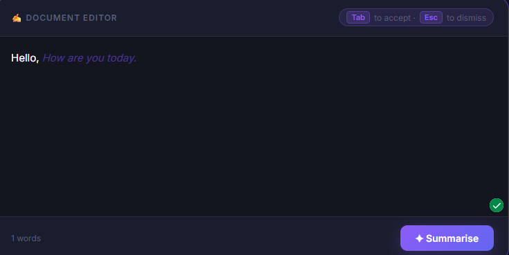
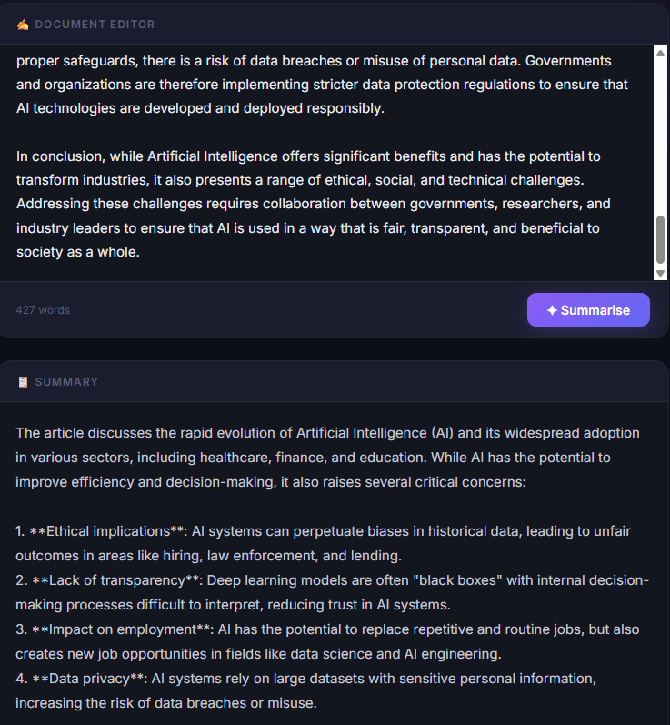

## Fix the Docs: Smarter, Faster, Maintainable Documentation for the Real World
### CONTEXT
In real-world tech environments, documentation is a critical but broken part of the software development lifecycle.

-Writing it is slow, repetitive, and often skipped.
-Reading it is painful and time-consuming, especially for new joiners.
-Maintaining it is impractical in fast-changing systems — documentation quickly becomes outdated, misleading, or irrelevant.

This leads to onboarding delays, wasted engineering time, and avoidable bugs — all due to poor or outdated docs.

<ins>**Function**</ins>
1. <ins>Simplify Writing</ins>
   - Auto-generate starter docs from code, git commits, or comments
   - Templates or AI suggestions to make writing faster
   - Real-time writing assistants or markdown validators

2. <ins>Speed Up Reading</ins>
   -Summarization tools (e.g., TL;DR for long docs)
   -Q&A search: Ask a question, get an answer (like ChatGPT for docs)
   -Visualizations (flow diagrams, API call graphs, changelogs)

Deploy-vercel: https://smart-docs-six.vercel.app/

application:

Suggestion word when typing

Summary and explaination of the text

future (Coming Soon): 
- Q&A features (Ask your document anything)
- able to Upload the PDF file
- able to make a mind map or the charts from the document